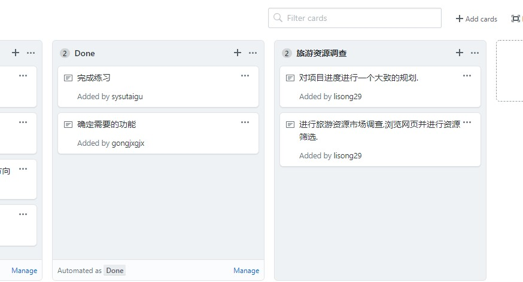
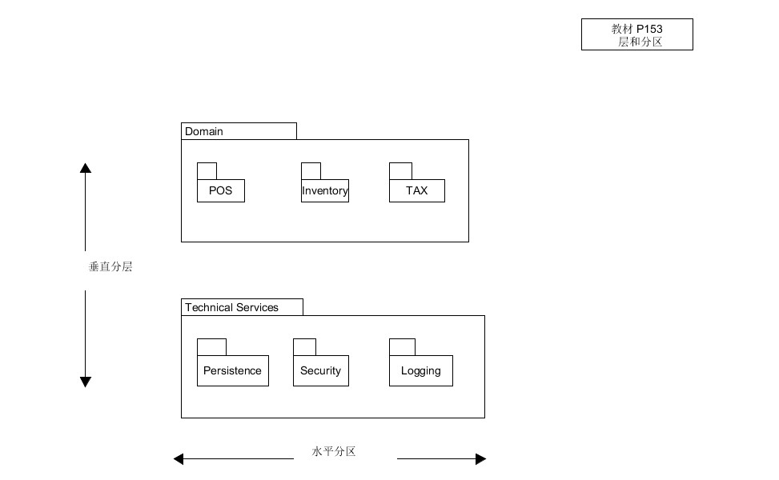

软件项目管理与知识管理基础
========

#1.简答题

- **用简短的语言给出对分析、设计的理解。**

 [分析](https://en.wikipedia.org/wiki/Analysis)：将复杂的的问题或实质分解为更小的部分以便更好地理解它。
在书中：分析强调的是对问题和需求的调查研究；

 [设计](https://en.wikipedia.org/wiki/Design)：有意创建用于构件对象或系统用于实现活动或过程的计划或规范。
在书中：设计强调的是满足需求的概念上的解决方案。

- **用一句话描述面向对象分析与设计的优势。**
  在面向对象分析过程中，强调的问题是领域内发现和描述对象（或概念）
 在面向对象设计过程中，强调的是定义软件对象以及他们如何协作以实现需求。
所以，对于面向对象分析与设计来讲，其优势在于能够构建与现实世界相对应的问题模型，并保持他们的结构、关系和行为模式。过程明确，实现明晰，方向明白。

- **简述UML（统一建模语言）的作用。考试考哪些图**

[统一建模语言（UML）](https://en.wikipedia.org/wiki/Unified_Modeling_Language) 是一种通用的可视化建模语言，用于对软件描述、可视化处理、构造和建立软件系统制品的文档，可用于对系统的理解、设计、浏览、配置、维护和信息控制，适用于各种软件开发方法、软件生命周期的各个阶段、各种应用领域以及各种开发工具，是一种总结了以往建模技术的经验并吸收了当今优秀成果的标准建模方法。

*考试考* 

 - 用例图
 - 静态图： 类图 、对象图、 包图 
 - 行为图： 交互图（顺序图 、合作图） 、状态图、 活动图 
 - 实现图 ：构件图、 部署图



- **从软件本质的角度，解释软件范围（需求）控制的可行性。**

软件范围（需求）控制是指从所获取的需求中选取最终的项目需求，然后制定出软件产品的详细描述。由于软件本身的复杂性、不可见性、不一致性、可变性，软件范围多数情况下对于客户和开发者都是模糊的。我们只要在满足客户基本需求的前提下，不断砍去用户不明确的需求，完成基本的功能，再通过多次迭代就能实现最终的软件设计。


#项目管理实践
- 看板使用练习（提交看板执行结果贴图，建议使用 Git project）
- 使用截图工具（png格式输出），展现你团队的任务 Kanban
- 每个人的任务是明确的。必须一周后可以看到具体结果
- 每个人的任务是1-2项
- 至少包含一个团队活动任务

  



#UML绘图工具实践



 


